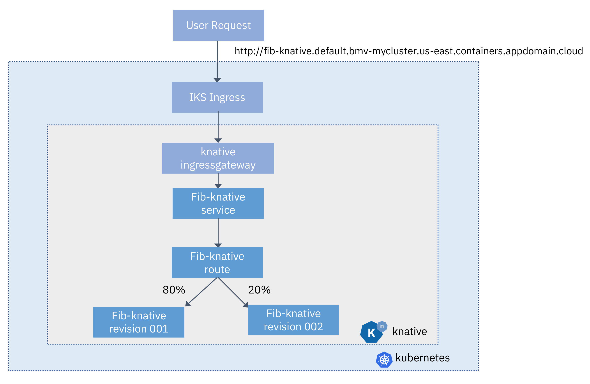

# Knative 101

In this lab, you'll learn about Knative, a new open source collaboration from IBM, Google, Pivotal, Red Hat, Cisco, and others. You'll create a new cluster on IKS, intall istio & knative to that cluster, and then deploy a node.js fibonacci application to Knative.

The knative application you'll create is a fibonacci sequence app. When provided with the number n, it will return the first n numbers of the fibonacci sequence: 1, 1, 2, 3.... You'll also deploy a vnext of the application, which starts the fibonacci sequence with 0 instead of 1: 0, 1, 1, 2, 3.... This application will be given a route from knative, which you'll configure to be the same host as your IKS cluster. You will then forward incoming requests to your IKS cluster to the knative gateway, which will then route requests to your application.

You'll learn to deploy applications using kubectl and a configuration yaml file, as well as to deploy applications using the knctl tool. You'll be able to see your application scale up when in use, and then scale back down to zero pods when it's not being used.

You'll also learn to work with revisions and routes, sending some percentage of your traffic to a new revision.

## License

[License](LICENSE)
