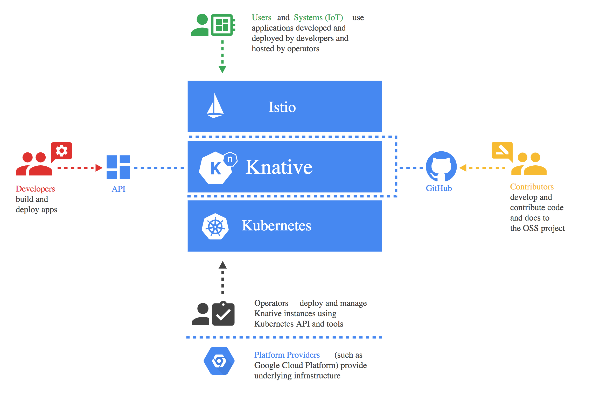
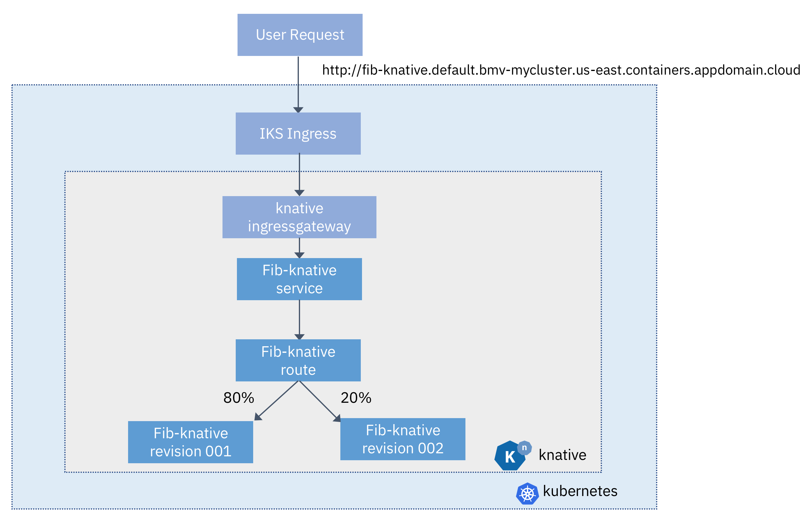

# Knative 101

In this lab, you'll learn about Knative, a new open source collaboration from IBM, Google, Pivotal, Red Hat, Cisco, and others. You'll create a new cluster on IBM Kubernetes Service (IKS), install Istio & Knative to that cluster, and then deploy a Node.js fibonacci application to Knative.

Knative is built on top of Istio & Kubernetes, and is a set of primitives for enabling serverless applications on Kubernetes.  Knative is made up of 3 components: Serving, Build, and Eventing.

Serving supports serving your applications, managing traffic, as well as routing and autoscaling.  Build supports creating a set of steps to build your application from source code to containers, on cluster.  Eventing enables you to create event producers and consumers for your application.

Two of the key Knative personas are Developers and platform providers. Developers can use Knative directly (or through an API) to build Serverless applications on top of Kubernetes.  Platform providers can use the Knative primitives to build their own Serverless platform on Kubernetes.

The Knative application you'll create is a fibonacci sequence app. When provided with the number n, it will return the first n numbers of the fibonacci sequence: 1, 1, 2, 3.... You'll also deploy a vnext of the application, which starts the fibonacci sequence with 0 instead of 1: 0, 1, 1, 2, 3.... The application will be given a domain, which you'll be able to curl to get the fibonacci results.

You'll learn to deploy applications using kubectl with a configuration yaml file, as well as to deploy applications using the kn CLI tool. You'll be able to see your application scale up when in use, and then scale back down to zero pods when it's not being used.

You'll also learn to work with revisions and routes, sending some percentage of your traffic to a new revision.

Get started with the [workshop](./exercise-0/README.md).
